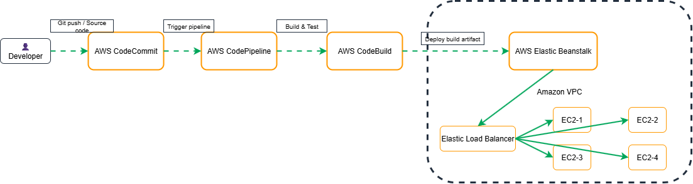

# AWS CI/CD Pipeline Architecture with CodeCommit, CodeBuild, CodePipeline & Elastic Beanstalk


<!-- Replace with your architecture diagram (PNG/GIF/SVG) -->

---

## 📌 Overview

This project demonstrates a **fully managed CI/CD pipeline on AWS**, enabling automated build, test, and deployment of applications using native AWS DevOps services.

The pipeline is designed to follow **DevOps best practices**, including:
- Infrastructure abstraction
- Automation
- Continuous Integration
- Continuous Deployment
- High availability and managed scaling

---

## 📑 Table of Contents

1. [Objective](#objective)
2. [Architecture Design](#architecture-design)
3. [Service Responsibilities](#service-responsibilities)
4. [CI/CD Workflow](#cicd-workflow)
5. [Pre-Requisites](#pre-requisites)
6. [Pipeline Implementation](#pipeline-implementation)
7. [Deployment Strategy](#deployment-strategy)
8. [Validation & Testing](#validation--testing)
9. [Security & Best Practices](#security--best-practices)
10. [Future Enhancements](#future-enhancements)

---

## 🎯 Objective

The objective of this project is to build a **scalable, reliable, and automated CI/CD pipeline** that:

- Automatically triggers on source code changes
- Builds and validates application artifacts
- Deploys applications with minimal manual intervention
- Leverages AWS-managed services to reduce operational overhead

---

## 🏗 Architecture Design

### High-Level Architecture

```text
Developer
   |
   | Git push
   v
AWS CodeCommit
   |
   | Source trigger
   v
AWS CodePipeline
   |
   | Build stage
   v
AWS CodeBuild
   |
   | Deployment artifact
   v
AWS Elastic Beanstalk
   |
   v
EC2 Instances + Load Balancer
