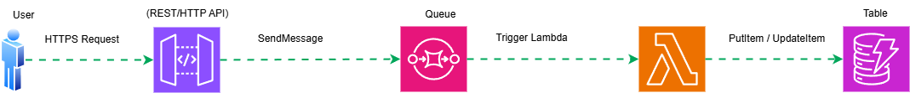

# Serverless Event-Driven Architecture on AWS

## Architecture Overview

This system is designed using a **serverless, event-driven architecture** on AWS.

**Request flow:**

The architecture decouples request ingestion from backend processing to improve:

- Scalability  
- Resilience  
- Fault isolation  
- Operational simplicity  

API Gateway exposes a secure public endpoint, Amazon SQS buffers traffic and guarantees delivery, AWS Lambda performs on-demand computation, and Amazon DynamoDB persists results with low-latency access.

---

## Component Description

### 1. User / Client

**Role:**  
External actor (browser, mobile app, desktop app, or service).

**Responsibilities:**
- Sends HTTPS requests to the public API Gateway endpoint.
- Provides request payload (JSON/body), headers, and authentication tokens if applicable.

**Boundary:**
- No direct access to internal AWS resources such as SQS, Lambda, or DynamoDB.

---

### 2. Amazon API Gateway

**Role:**  
Front door of the backend system.

**Responsibilities:**
- Receives HTTPS requests from clients.
- Enforces API-level controls:
  - Authentication / Authorization
  - Throttling and rate limiting
  - Request validation
- Optionally transforms incoming requests using mapping templates.
- Publishes accepted requests as messages to Amazon SQS (`SendMessage`).

**Key Notes:**
- API Gateway should remain **thin**; no business logic is executed here.
- CloudWatch logging and metrics should be enabled for observability.
- APIs typically return an **acknowledgment response** (e.g., `202 Accepted`) instead of final processing results.

---

### 3. Amazon SQS

**Role:**  
Asynchronous message buffer and decoupling layer.

**Responsibilities:**
- Stores messages durably until processed successfully.
- Absorbs traffic spikes to protect downstream services.
- Provides retry semantics using visibility timeout and redelivery.

**Key Notes:**
- SQS does **not** directly invoke Lambda.
- AWS uses an **Event Source Mapping** to poll the queue on Lambda’s behalf.
- A **Dead-Letter Queue (DLQ)** is recommended to isolate poison messages.
- Queue configuration (visibility timeout, retention period, maxReceiveCount) significantly affects reliability and cost.

---

### 4. AWS Lambda

**Role:**  
On-demand compute for asynchronous message processing.

**Trigger Mechanism:**
- An Event Source Mapping connects SQS to Lambda.
- AWS continuously polls the queue and invokes Lambda with message batches.

**Responsibilities:**
- Validates message schema.
- Executes business logic (transformation, enrichment, computation).
- Writes results to DynamoDB.
- Handles failures; unprocessed messages are retried automatically.

**Key Notes:**
- Batch size and partial batch failure handling must be configured carefully.
- **Idempotency is mandatory** due to SQS at-least-once delivery.
- Reserved concurrency can be used to protect downstream systems and control costs.

---

### 5. Amazon DynamoDB

**Role:**  
Persistent storage for processed results.

**Responsibilities:**
- Stores records with predictable, low-latency read/write performance.
- Automatically scales without server management.

**Key Notes:**
- Primary key design must align with access patterns.
- Conditional writes or idempotency keys prevent duplicate records.
- TTL can be enabled to auto-expire transient data.
- DynamoDB Streams can be enabled for future downstream consumers.

---

## Process Flow

1. Client submits an HTTPS request to API Gateway.
2. API Gateway authenticates, validates, and applies throttling rules.
3. API Gateway publishes the request payload to Amazon SQS.
4. SQS stores the message durably.
5. AWS polls the queue and invokes Lambda with a batch of messages.
6. Lambda processes each message and writes results to DynamoDB.
7. On success, messages are deleted from SQS.
8. On failure, messages are retried or routed to the DLQ after exceeding retry limits.

---

## Architecture Characteristics

### Serverless
- No server provisioning, scaling, or patching required.
- Compute scales automatically based on message volume.

### Loosely Coupled
- API ingestion and backend processing are decoupled via SQS.
- Each component scales independently.

### Scalability
- API Gateway handles large request volumes.
- SQS buffers bursts.
- Lambda scales horizontally based on queue depth.

### Resilience & Fault Isolation
- Temporary Lambda failures do not block request ingestion.
- Messages remain in SQS until processed successfully.

### Delivery Semantics
- SQS guarantees **at-least-once delivery**.
- Lambda logic must be idempotent to avoid duplicate writes.

### Security
- Public exposure is limited to API Gateway.
- Internal service access is controlled via IAM roles and least-privilege policies.

### Observability
- CloudWatch logs and metrics provide end-to-end visibility.
- Failures can be traced across API Gateway, SQS, and Lambda.

---

## Recommended Hardening (Best Practices)

- Configure an SQS Dead-Letter Queue (DLQ) with `maxReceiveCount`.
- Enforce IAM least privilege:
  - API Gateway role: `sqs:SendMessage` only.
  - Lambda role: `dynamodb:PutItem`, `UpdateItem` (and `GetItem` if required).
- Implement idempotency:
  - Use a unique `requestId` as the DynamoDB primary key.
  - Apply conditional writes to prevent duplicates.
- Tune SQS and Lambda:
  - Batch size
  - Visibility timeout alignment
  - Reserved concurrency
- Improve traceability:
  - Propagate a correlation ID from API → SQS → Lambda logs.

---

## Summary

This architecture provides a robust, scalable, and fault-tolerant foundation for asynchronous workloads using fully managed AWS services. It is well-suited for high-throughput APIs, background processing, and systems requiring strong decoupling between ingestion and execution.
