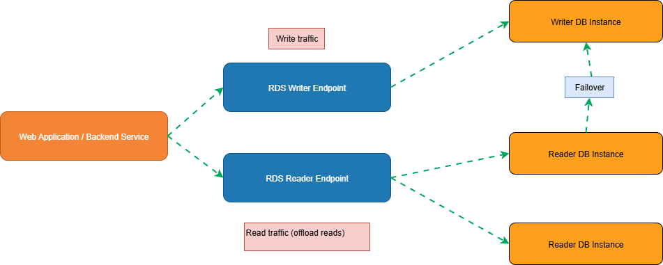

# Amazon RDS Multi-AZ DB Cluster with Reader Endpoint (PostgreSQL)

A production-ready reference architecture for **high availability**, **fast failover**, and **read scaling** using an **Amazon RDS Multi-AZ DB cluster** for PostgreSQL.  
This design separates **write traffic** (to the writer endpoint) from **read traffic** (to the reader endpoint) to offload the primary instance and improve overall throughput while maintaining operational simplicity.

---

## Architecture Overview

This architecture uses an **RDS Multi-AZ DB cluster** that contains:
- **One Writer DB instance** (handles all write operations and strongly consistent reads immediately after writes).
- **Multiple Reader DB instances** (handle read-only traffic and can be promoted during failover).
- Two stable endpoints:
  - **Writer Endpoint** for writes (and read-after-write workloads).
  - **Reader Endpoint** for read scaling (distributed across reader instances).

The key operational benefits are:
- **High availability across multiple Availability Zones (AZs)**.
- **Automatic failover** (typically within seconds in most scenarios).
- **Read traffic offloading** through the **Reader Endpoint**.
- **Minimal application changes**: route reads and writes to different endpoints.

---

## Diagram (Logical)

---

## Components and Why They Matter

### 1) Web Application / Backend Service
**Role**
- Initiates database connections and executes SQL queries.
- Splits traffic by intent:
  - **Writes** (INSERT/UPDATE/DELETE, transactions) go to the **Writer Endpoint**.
  - **Reads** (SELECT) go to the **Reader Endpoint** where appropriate.

**Effectiveness**
- Improves performance by avoiding unnecessary load on the writer.
- Enables scaling read-heavy workloads without increasing write-node pressure.
- Supports resilience by reconnecting to stable endpoints after failover events.

---

### 2) RDS Writer Endpoint
**Role**
- A stable DNS endpoint pointing to the **current Writer DB instance**.
- Receives:
  - All **write operations**.
  - **Read-after-write** traffic that requires immediate consistency.

**Effectiveness**
- Eliminates the need for applications to track the writer instance directly.
- During failover, the endpoint continues to represent the current writer after promotion.

**Best Practice**
- Use a dedicated connection pool for the writer endpoint.
- Use transactions and strong consistency requirements only on the writer path.

---

### 3) RDS Reader Endpoint
**Role**
- A stable DNS endpoint that load-balances reads across **available Reader DB instances**.
- Receives:
  - **Read-only operations** that can tolerate replica routing.

**Effectiveness**
- Offloads read traffic from the writer to improve throughput and reduce latency.
- Enables horizontal read scaling by adding more reader instances.
- Simplifies read scaling because the application uses one endpoint rather than many.

**Best Practice**
- Route analytic/reporting queries and high-volume read endpoints here.
- Be mindful of read consistency requirements (see “Consistency Notes”).

---

### 4) Writer DB Instance
**Role**
- Primary database node responsible for:
  - All **writes**.
  - Transaction coordination.
  - Strongly consistent reads (read-after-write).

**Effectiveness**
- Ensures integrity and correctness for transactional workloads.
- Remains protected by multi-AZ architecture with automatic failover.

**Operational Notes**
- Monitor CPU, memory, storage, connections, and long-running transactions.
- Keep the writer focused on OLTP/transactional performance by offloading reads.

---

### 5) Reader DB Instance(s)
**Role**
- Read-only replicas within the same RDS cluster.
- Serve read requests through the **Reader Endpoint**.
- **Failover candidates**: one reader can be promoted to writer automatically.

**Effectiveness**
- Provides read scalability without requiring application-level sharding.
- Improves availability because readers are located in separate AZs.
- Supports fast recovery: promotion to writer reduces downtime in failure events.

**Operational Notes**
- Scale horizontally by adding readers when read latency or CPU increases.
- Use CloudWatch metrics to tune autoscaling or capacity planning.

---

### 6) Automatic Failover
**Role**
- Promotes a reader to writer when:
  - Writer instance fails
  - AZ impairment occurs
  - Certain infrastructure faults are detected

**Effectiveness**
- Minimizes downtime and maintains service continuity.
- Applications can continue operating by reconnecting to the same endpoints.

**Important Behavior**
- **Endpoints remain stable** (Writer Endpoint still points to the writer after promotion).
- The application should implement:
  - connection retry logic
  - exponential backoff
  - idempotent write handling where appropriate

---

## Detailed Request Flow

### A) Write Path (Transactional Workloads)
1. Application receives a request that requires a database write.
2. Application connects to **RDS Writer Endpoint**.
3. Writer endpoint routes the connection to the **Writer DB instance**.
4. Writer executes SQL write operations (INSERT/UPDATE/DELETE).
5. Commit completes, and the application returns success to the client.

**Outcome**
- Strong consistency and correct transactional behavior.
- Writer maintains authoritative state.

---

### B) Read Path (Offloading Reads)
1. Application receives a request that requires a read (SELECT).
2. Application connects to **RDS Reader Endpoint**.
3. Reader endpoint routes the query to one of the **Reader DB instances**.
4. Reader executes the query and returns results.
5. Application returns results to the client.

**Outcome**
- Reduced load on the writer.
- Improved concurrency and throughput for read-heavy workloads.

---

### C) Failover Scenario (Writer Failure)
1. A failure occurs on the Writer DB instance or its AZ.
2. RDS automatically selects a healthy Reader DB instance.
3. The selected reader is **promoted** to become the new writer.
4. **Writer Endpoint** updates behind the scenes to point to the newly promoted writer.
5. Application connections may experience brief errors and must retry.
6. After reconnect, writes resume through the same Writer Endpoint.

**Outcome**
- Fast recovery with minimal operational intervention.
- No manual endpoint changes required in the application.

---

## Consistency Notes (Read vs Write)
- Use **Writer Endpoint** for:
  - read-after-write requirements
  - strict transactional correctness
  - workflows requiring immediate consistency
- Use **Reader Endpoint** for:
  - high-volume reads
  - dashboards, reporting queries
  - traffic that can tolerate replica-based routing

If your application cannot tolerate any replica lag, route those reads to the writer.

---

## Operational Excellence Checklist

- **Connectivity**
  - Enable connection retries with exponential backoff.
  - Separate connection pools for writer vs reader endpoints.

- **Monitoring**
  - Track CloudWatch metrics: CPUUtilization, DatabaseConnections, ReadLatency, WriteLatency.
  - Alarm on failover events and error spikes.

- **Scaling**
  - Add reader instances when read latency increases.
  - Consider query optimization before scaling compute.

- **Security**
  - Use TLS connections to the endpoints.
  - Apply least-privilege IAM for RDS management operations.
  - Use Secrets Manager for credentials rotation.

---

## When to Use This Architecture
Use this design when you need:
- Highly available PostgreSQL with minimal administrative overhead
- Fast automatic failover for production workloads
- Read scaling to offload the primary instance
- Stable endpoints that simplify application configuration

---

## Summary
This architecture provides:
- **High availability** across AZs with automatic failover
- **Read scaling** via the Reader Endpoint
- **Operational simplicity** using managed RDS endpoints
- **Performance gains** by isolating write and read traffic paths
