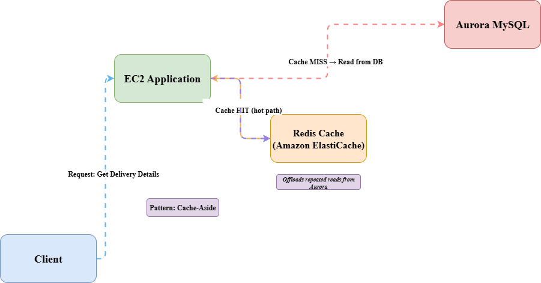

# Package Delivery App — Read Scaling with Redis Cache-Aside (Aurora MySQL)

A package delivery application runs on Amazon EC2 and stores delivery data in an Amazon Aurora MySQL cluster.  
As traffic grows, database **read load** increases significantly due to repeated queries for delivery details.

This project documents a **cost-effective read scaling design** using **Amazon ElastiCache for Redis** with the **Cache-Aside** pattern to offload repeated reads from Aurora.

---

## Architecture Overview

**Goal:** Reduce Aurora read pressure by serving frequently requested delivery details from Redis.

High-level flow:




**Key idea:**  
- **Cache HIT:** return cached delivery details, bypassing Aurora.  
- **Cache MISS:** read from Aurora, then populate Redis with a TTL.

---

## Components

### Client
- Sends requests to retrieve delivery details.
- Typically calls an HTTP endpoint served by the EC2 application.

### EC2 Application (Compute Tier)
- Handles request routing and business logic.
- Implements cache-aside logic:
  - Query Redis first.
  - Fall back to Aurora on cache miss.
  - Populate or invalidate cache when needed.

### Amazon ElastiCache for Redis (Caching Tier)
- Stores hot delivery details to reduce repeated reads.
- Recommended features:
  - Multi-AZ replication group (where applicable)
  - Automatic failover
  - TTL-based eviction

### Amazon Aurora MySQL (Data Tier)
- System of record for delivery details.
- Aurora remains the authoritative store; Redis holds derived cached copies.

---

## Data Access Pattern: Cache-Aside

### Read Path (Get Delivery Details)

1. App checks Redis with a deterministic key: `delivery:{id}`
2. If **HIT**, return cached value immediately.
3. If **MISS**, query Aurora.
4. Store the result in Redis with a TTL.
5. Return the result to the client.

**Redis commands (conceptual):**
```bash
GET delivery:12345
SET delivery:12345 "<json>" EX 300
