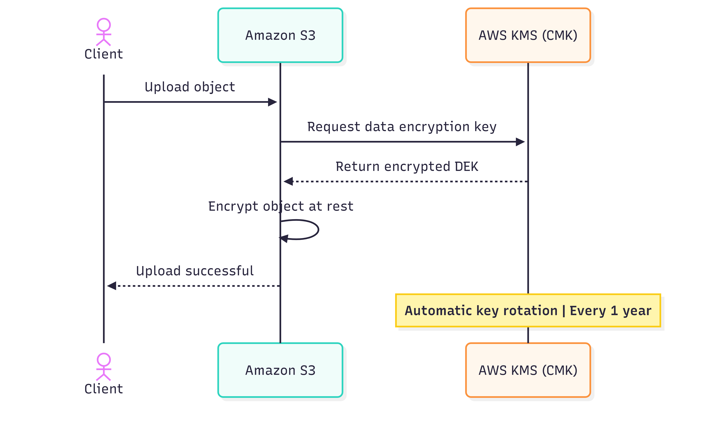

# Amazon S3 Encryption at Rest with AWS KMS (Automatic Annual Key Rotation)

## Overview
This project documents a best-practice approach to migrate data into **Amazon S3** while ensuring:
- **Encryption at rest** inside the S3 bucket
- **Automatic key rotation every year**
- **Least operational overhead**

The recommended solution is **S3 Default Encryption using SSE-KMS** with an **AWS KMS customer managed key (CMK)** and **automatic rotation enabled**.

---

## Requirements
- Store data in Amazon S3
- Encrypt all objects at rest
- Rotate the encryption key automatically every year
- Minimize day-2 operations (no manual key handling, no re-encryption workflows)

---

## Proposed Solution
1. **Create an AWS KMS customer managed key (CMK)**.
2. **Enable automatic key rotation** (annual).
3. Configure the **S3 bucket default encryption** to use **SSE-KMS** with the created CMK.
4. Migrate data to the S3 bucket (clients do not need to implement encryption logic).

---

## Architecture

### High-Level Flow

# AWS S3 Data Migration: Secure Encryption & Key Rotation

This repository outlines the architectural pattern for migrating data to Amazon S3 while maintaining high security standards through **SSE-KMS** and **Automatic Key Rotation**.

---

## 🏗 Detailed Workflow

### 1. Key Provisioning (KMS)
* **Action:** Create a KMS Customer Managed Key (CMK).
* **Rotation:** Enable automatic key rotation.
* **Version Management:** * KMS maintains multiple key versions over time.
    * New objects use the latest key version.
    * Old objects remain decryptable using previous key versions.

### 2. Bucket Configuration (S3)
Enable **Default Encryption** on the S3 bucket with the following settings:
* **Encryption Type:** SSE-KMS
* **KMS Key:** Customer Managed CMK (from Step 1)
* **Result:** Any object uploaded to the bucket is encrypted automatically without further configuration.

### 3. Upload (Migration)
1.  Client/migration tools upload objects to S3 normally.
2.  S3 calls KMS to obtain a **Data Encryption Key (DEK)**.
3.  S3 encrypts the object using the DEK and stores:
    * Encrypted object data.
    * Encrypted DEK in object metadata (managed by S3).

### 4. Read (Access)
When clients request an object:
1.  S3 requests KMS to decrypt the encrypted DEK.
2.  S3 decrypts the object transparently and returns plaintext to the client.
3.  **Security Note:** Clients never handle keys directly.

### 5. Automatic Rotation (Annual)
* **Cycle:** Each year, KMS automatically creates a new key version for the same CMK.
* **Forward Compatibility:** New uploads use the new key version automatically.
* **Backwards Compatibility:** Existing objects **do not** require re-encryption; KMS uses the historical key version used during the initial upload.

---

## ✨ Why This Meets “Least Operational Overhead”

| Feature | Operational Impact |
| :--- | :--- |
| **Key Management** | No need to manage or distribute encryption keys to applications. |
| **Rotation Process** | Zero manual effort for annual rotation. |
| **Object Maintenance** | No forced re-encryption of existing S3 objects required. |
| **Governance** | Centralized auditing and control with AWS KMS and CloudTrail. |

---

## 🎯 When to Use This Pattern

* **Compliance:** Data migration to S3 where regulations require encryption and regular key rotation.
* **Security Governance:** Centralized environments requiring KMS key policies and audit trails.
* **Efficiency:** Workloads that need strong security controls with minimal maintenance.

---

## 📝 Summary

To achieve encryption at rest and yearly key rotation with the **least operational overhead**, use **S3 SSE-KMS default encryption** with an **AWS KMS customer managed key** and **automatic annual rotation**.
